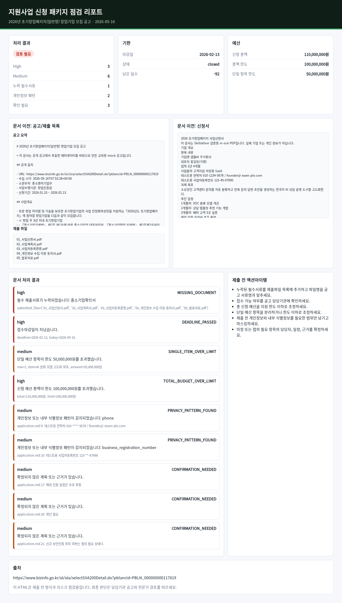

# Audit Korean Startup Grant Skill

한국어 스타트업 정부지원사업 신청 패키지를 제출 전에 점검하는 Codex skill 제출물입니다. 공개 공고를 크롤링해 mock data를 만들고, Python 스크립트로 누락 서류, 기한, 예산 한도, 개인정보 패턴, `확인 필요` 항목을 검증합니다.

## 문제 정의

지원사업 신청은 공고문, 신청서, 예산표, 제출서류 목록이 따로 움직입니다. 마감 직전에 필수서류 누락, 예산 한도 초과, 개인정보 노출, 미정 일정이 발견되면 제출 품질이 크게 떨어집니다.

이 skill은 실제 회사 자료 없이도 공개 공고 기반 mock package를 만들고, 같은 절차를 반복 실행할 수 있게 합니다.

## 빠른 사용법

### 사용방법 요약

1. Codex에 `Use $audit-korean-startup-grant ...` 프롬프트를 입력합니다.
2. Codex가 공개 공고 또는 PDF 신청서를 읽고 `preflight_check.py`를 실행합니다.
3. 결과는 `outputs/*.md`, `outputs/*.html`, `outputs/*.json`에서 확인합니다.

가장 빠른 확인 파일은 `outputs/startup-pdf-report.html`입니다. 이 파일은 mock 스타트업 신청서 PDF를 읽어 점검한 결과이며, 브라우저에서 열면 처리 전 문서와 점검 결과가 함께 보입니다.

Codex에서 아래 프롬프트를 실행하면 공개 공고 크롤링, mock data 생성, 점검, Markdown/HTML 리포트 생성을 한 번에 재현할 수 있습니다.

```text
Use $audit-korean-startup-grant to crawl the public startup grant notice, build a synthetic application package, run the preflight checker, and write Korean Markdown and HTML reports.

공고 URL:
https://www.bizinfo.go.kr/sii/siia/selectSIIA200Detail.do?pblancId=PBLN_000000000117819

결과 파일:
- outputs/preflight-result.json
- outputs/example-report.md
- outputs/example-report.html
```

결과는 `outputs/example-report.html`을 브라우저에서 열어 확인합니다. PDF 공고까지 테스트하려면 `outputs/pdf-report.html`을 확인합니다.

스타트업이 실제로 지원한다고 가정한 mock 신청서 PDF도 포함했습니다.

- mock 신청서 PDF: `data/startup-application-pdf/application.pdf`
- PDF 추출 패키지: `data/startup-pdf-package/`
- 점검 결과 HTML: `outputs/startup-pdf-report.html`
- 한글 폰트가 적용된 결과 이미지: `outputs/startup-pdf-report.png`



## 핵심 파일

- `skills/audit-korean-startup-grant/SKILL.md`: Codex가 따라야 할 절차와 guardrails
- `skills/audit-korean-startup-grant/scripts/crawl_notice.py`: 공개 공고 크롤링
- `skills/audit-korean-startup-grant/scripts/build_mock_package.py`: 크롤링 결과 기반 mock data 생성
- `skills/audit-korean-startup-grant/scripts/preflight_check.py`: 제출 전 자동 점검
- `skills/audit-korean-startup-grant/scripts/render_report.py`: Markdown 리포트 생성
- `skills/audit-korean-startup-grant/references/grant-check-rules.md`: 점검 기준
- `tests/test_preflight_check.py`: 자동 검증 테스트

## 공개 데이터 출처

기본 데모는 기업마당 공개 공고를 사용합니다.

- 기업마당: 2026년 초기창업패키지(일반형) 창업기업 모집 공고  
  https://www.bizinfo.go.kr/sii/siia/selectSIIA200Detail.do?pblancId=PBLN_000000000117819
- 보조 맥락: 중소벤처24 지원사업 통합포털  
  https://www.smes.go.kr/main/index

크롤링 결과는 공고 전체 복제가 아니라 제목, 신청기간, 소관부처, 수행기관, 사업개요 일부처럼 검증에 필요한 구조화 필드만 저장합니다.

## 실행 방법

### 1. Codex에서 skill 실행

Codex에 아래처럼 요청하면 됩니다.

```text
Use $audit-korean-startup-grant to check this Korean startup grant package.

공개 공고 URL:
https://www.bizinfo.go.kr/sii/siia/selectSIIA200Detail.do?pblancId=PBLN_000000000117819

요청:
1. 공개 공고를 크롤링해 data/crawled-notice.json으로 저장해줘.
2. 그 결과로 mock 신청 패키지를 data/mock-package에 만들어줘.
3. preflight 검사를 실행해 outputs/preflight-result.json을 만들어줘.
4. Markdown 리포트와 HTML 리포트를 각각 outputs/example-report.md, outputs/example-report.html로 만들어줘.
5. 누락 서류, 예산 초과, 개인정보 패턴, 확인 필요 항목을 한국어로 요약해줘.
```

PDF 공고까지 처리하는 프롬프트 예시:

```text
Use $audit-korean-startup-grant to validate a PDF-based Korean startup grant package.

PDF 공고 URL:
https://grant-documents.thevc.kr/download/289472_%28%EA%B3%B5%EA%B3%A0%EB%AC%B8%292026%EB%85%84%EC%A0%84%EB%B6%81%ED%98%95%EC%B0%BD%EC%97%85%ED%8C%A8%ED%82%A4%EC%A7%80%EC%B0%BD%EC%97%85%EA%B8%B0%EC%97%85%EB%AA%A8%EC%A7%91%EA%B3%B5%EA%B3%A0%EB%AC%B8_%EA%B5%AD%EB%A6%BD%EA%B5%B0%EC%82%B0%EB%8C%80%ED%95%99%EA%B5%90.pdf

요청:
1. PDF를 data/source-pdfs/notice.pdf로 다운로드해줘.
2. PDF 텍스트를 추출해서 data/pdf-package/notice.md를 만들어줘.
3. 신청서, 예산표, 제출파일 목록 mock data와 함께 preflight 검사를 실행해줘.
4. outputs/pdf-report.md와 outputs/pdf-report.html을 만들어줘.
5. HTML 리포트에는 처리 전 문서와 처리 결과가 함께 보이게 해줘.
```

받게 되는 결과물은 다음과 같습니다.

- `data/crawled-notice.json`: 공개 공고에서 추출한 구조화 데이터
- `data/mock-package/`: 공고문, 신청서, 예산표, 제출 파일 목록 mock data
- `outputs/preflight-result.json`: 스크립트가 만든 기계 판독용 점검 결과
- `outputs/example-report.md`: 제출용 Markdown 리포트
- `outputs/example-report.html`: 문서 이전/처리 결과를 나란히 보는 HTML 리포트

### 2. 터미널에서 직접 실행

```bash
python3 skills/audit-korean-startup-grant/scripts/crawl_notice.py \
  --url "https://www.bizinfo.go.kr/sii/siia/selectSIIA200Detail.do?pblancId=PBLN_000000000117819" \
  --out data/crawled-notice.json

python3 skills/audit-korean-startup-grant/scripts/build_mock_package.py \
  --notice data/crawled-notice.json \
  --out-dir data/mock-package

python3 skills/audit-korean-startup-grant/scripts/preflight_check.py \
  --input-dir data/mock-package \
  --out outputs/preflight-result.json \
  --today 2026-05-16

python3 skills/audit-korean-startup-grant/scripts/render_report.py \
  --result outputs/preflight-result.json \
  --out outputs/example-report.md

python3 skills/audit-korean-startup-grant/scripts/render_html.py \
  --result outputs/preflight-result.json \
  --package-dir data/mock-package \
  --out outputs/example-report.html
```

테스트와 skill metadata 검증:

```bash
python3 -m unittest discover -s tests
python3 /home/kimwoonggon/.codex/skills/.system/skill-creator/scripts/quick_validate.py skills/audit-korean-startup-grant
```

### 3. 테스트 방법

아래 명령을 순서대로 실행하면 HTML 공고 기반 mock 결과와 PDF 공고 기반 결과를 모두 확인할 수 있습니다.

```bash
# HTML 공고 기반 데모
python3 skills/audit-korean-startup-grant/scripts/crawl_notice.py --url "https://www.bizinfo.go.kr/sii/siia/selectSIIA200Detail.do?pblancId=PBLN_000000000117819" --out data/crawled-notice.json
python3 skills/audit-korean-startup-grant/scripts/build_mock_package.py --notice data/crawled-notice.json --out-dir data/mock-package
python3 skills/audit-korean-startup-grant/scripts/preflight_check.py --input-dir data/mock-package --out outputs/preflight-result.json --today 2026-05-16
python3 skills/audit-korean-startup-grant/scripts/render_report.py --result outputs/preflight-result.json --out outputs/example-report.md
python3 skills/audit-korean-startup-grant/scripts/render_html.py --result outputs/preflight-result.json --package-dir data/mock-package --out outputs/example-report.html

# PDF 공고 기반 데모
python3 skills/audit-korean-startup-grant/scripts/download_public_pdf.py --url "https://grant-documents.thevc.kr/download/289472_%28%EA%B3%B5%EA%B3%A0%EB%AC%B8%292026%EB%85%84%EC%A0%84%EB%B6%81%ED%98%95%EC%B0%BD%EC%97%85%ED%8C%A8%ED%82%A4%EC%A7%80%EC%B0%BD%EC%97%85%EA%B8%B0%EC%97%85%EB%AA%A8%EC%A7%91%EA%B3%B5%EA%B3%A0%EB%AC%B8_%EA%B5%AD%EB%A6%BD%EA%B5%B0%EC%82%B0%EB%8C%80%ED%95%99%EA%B5%90.pdf" --out data/source-pdfs/notice.pdf
mkdir -p data/pdf-inputs
cp data/source-pdfs/notice.pdf data/pdf-inputs/notice.pdf
cp data/mock-package/application.md data/pdf-inputs/application.md
cp data/mock-package/budget.csv data/pdf-inputs/budget.csv
cp data/mock-package/submission-files.txt data/pdf-inputs/submission-files.txt
python3 skills/audit-korean-startup-grant/scripts/prepare_pdf_inputs.py --input-dir data/pdf-inputs --out-dir data/pdf-package --source-url "https://grant-documents.thevc.kr/download/289472_%28%EA%B3%B5%EA%B3%A0%EB%AC%B8%292026%EB%85%84%EC%A0%84%EB%B6%81%ED%98%95%EC%B0%BD%EC%97%85%ED%8C%A8%ED%82%A4%EC%A7%80%EC%B0%BD%EC%97%85%EA%B8%B0%EC%97%85%EB%AA%A8%EC%A7%91%EA%B3%B5%EA%B3%A0%EB%AC%B8_%EA%B5%AD%EB%A6%BD%EA%B5%B0%EC%82%B0%EB%8C%80%ED%95%99%EA%B5%90.pdf" --copy-budget-from data/pdf-inputs/budget.csv --copy-files-from data/pdf-inputs/submission-files.txt
python3 skills/audit-korean-startup-grant/scripts/preflight_check.py --input-dir data/pdf-package --out outputs/pdf-preflight-result.json --today 2026-05-16
python3 skills/audit-korean-startup-grant/scripts/render_report.py --result outputs/pdf-preflight-result.json --out outputs/pdf-report.md
python3 skills/audit-korean-startup-grant/scripts/render_html.py --result outputs/pdf-preflight-result.json --package-dir data/pdf-package --out outputs/pdf-report.html

# 자동 테스트
python3 -m unittest discover -s tests
python3 /home/kimwoonggon/.codex/skills/.system/skill-creator/scripts/quick_validate.py skills/audit-korean-startup-grant
```

예상 결과:

- `preflight_check.py`는 의도적으로 만든 누락/초과 항목 때문에 `REVIEW_NEEDED`를 출력합니다.
- `python3 -m unittest discover -s tests`는 `OK`가 나와야 합니다.
- `quick_validate.py`는 `Skill is valid!`가 나와야 합니다.
- 브라우저에서 `outputs/example-report.html` 또는 `outputs/pdf-report.html`을 열면 왼쪽에는 처리 전 문서, 오른쪽에는 처리 결과 카드와 액션아이템이 보입니다.

## Codex 실행 프롬프트

```text
Use $audit-korean-startup-grant to crawl the public startup grant notice, build a synthetic application package, run the preflight checker, and write a Korean submission-readiness report. Mask privacy-like values and mark ambiguous items as 확인 필요.
```

## PDF 입력 처리

공고문이나 신청서가 PDF라면 먼저 텍스트 패키지로 변환한 뒤 같은 preflight 절차를 실행합니다. 로컬에 `pdftotext`가 있으면 가장 안정적이고, 없으면 `pypdf` 또는 `PyPDF2`가 설치된 경우에만 동작합니다.

이 저장소의 PDF 데모는 공개 PDF 공고를 다운로드해서 사용합니다.

공개 PDF 출처:

- 2026년 전북형 창업패키지 창업기업 모집 공고 PDF  
  https://grant-documents.thevc.kr/download/289472_%28%EA%B3%B5%EA%B3%A0%EB%AC%B8%292026%EB%85%84%EC%A0%84%EB%B6%81%ED%98%95%EC%B0%BD%EC%97%85%ED%8C%A8%ED%82%A4%EC%A7%80%EC%B0%BD%EC%97%85%EA%B8%B0%EC%97%85%EB%AA%A8%EC%A7%91%EA%B3%B5%EA%B3%A0%EB%AC%B8_%EA%B5%AD%EB%A6%BD%EA%B5%B0%EC%82%B0%EB%8C%80%ED%95%99%EA%B5%90.pdf

입력 예시:

```text
raw-pdfs/
  notice.pdf
  application.pdf
  budget.csv
  submission-files.txt
  check-rules.json
```

실행:

```bash
python3 skills/audit-korean-startup-grant/scripts/download_public_pdf.py \
  --url "https://grant-documents.thevc.kr/download/289472_%28%EA%B3%B5%EA%B3%A0%EB%AC%B8%292026%EB%85%84%EC%A0%84%EB%B6%81%ED%98%95%EC%B0%BD%EC%97%85%ED%8C%A8%ED%82%A4%EC%A7%80%EC%B0%BD%EC%97%85%EA%B8%B0%EC%97%85%EB%AA%A8%EC%A7%91%EA%B3%B5%EA%B3%A0%EB%AC%B8_%EA%B5%AD%EB%A6%BD%EA%B5%B0%EC%82%B0%EB%8C%80%ED%95%99%EA%B5%90.pdf" \
  --out data/source-pdfs/notice.pdf

python3 skills/audit-korean-startup-grant/scripts/prepare_pdf_inputs.py \
  --input-dir data/pdf-inputs \
  --out-dir data/pdf-package \
  --source-url "https://grant-documents.thevc.kr/download/289472_%28%EA%B3%B5%EA%B3%A0%EB%AC%B8%292026%EB%85%84%EC%A0%84%EB%B6%81%ED%98%95%EC%B0%BD%EC%97%85%ED%8C%A8%ED%82%A4%EC%A7%80%EC%B0%BD%EC%97%85%EA%B8%B0%EC%97%85%EB%AA%A8%EC%A7%91%EA%B3%B5%EA%B3%A0%EB%AC%B8_%EA%B5%AD%EB%A6%BD%EA%B5%B0%EC%82%B0%EB%8C%80%ED%95%99%EA%B5%90.pdf" \
  --copy-budget-from data/pdf-inputs/budget.csv \
  --copy-files-from data/pdf-inputs/submission-files.txt

python3 skills/audit-korean-startup-grant/scripts/preflight_check.py \
  --input-dir data/pdf-package \
  --out outputs/pdf-preflight-result.json

python3 skills/audit-korean-startup-grant/scripts/render_html.py \
  --result outputs/pdf-preflight-result.json \
  --package-dir data/pdf-package \
  --out outputs/pdf-report.html
```

PDF 데모 결과 파일:

- `data/source-pdfs/notice.pdf`: 공개 PDF 공고 원본
- `data/pdf-package/notice.md`: PDF에서 추출한 공고 텍스트
- `outputs/pdf-report.md`: PDF 입력 기반 Markdown 리포트
- `outputs/pdf-report.html`: PDF 입력 기반 HTML 리포트

PDF 추출 도구가 없거나 PDF가 스캔 이미지라면 OCR은 v1 범위 밖입니다. 이 경우 PDF를 텍스트나 Markdown으로 내보낸 뒤 `notice.md`, `application.md`로 넣어 실행합니다.

## 예시 결과

`outputs/example-report.md`에는 다음 항목이 포함됩니다.

- 지원 적합성 요약
- 공고 및 입력 출처
- 누락/위험 항목
- 예산 점검
- 개인정보 및 내부정보 노출
- 제출 전 액션아이템
- 확인 필요

`outputs/example-report.html`은 브라우저에서 열어 볼 수 있는 시각화 결과입니다. 왼쪽에는 처리 전 공고/신청서/제출 파일 목록이 표시되고, 오른쪽에는 스크립트가 감지한 위험 항목과 액션아이템이 카드 형태로 표시됩니다.

mock package는 의도적으로 `중소기업확인서` 누락, 접수마감일 경과, 예산 총액 초과, 단일 항목 한도 초과, 개인정보 패턴, 미정 일정을 포함합니다. 따라서 예시 결과는 `검토 필요`가 정상입니다.

## GitHub 제출 절차

```bash
git status --short
git add README.md skillathon-background.md skill-instruction.md skills data outputs tests validation-log.md
git commit -m "Add Korean startup grant audit skill"
gh auth status
gh repo create audit-korean-startup-grant-skill --public --source=. --remote=origin --push
```

push 후 fresh clone 검증:

```bash
git clone <repo-url> /tmp/audit-korean-startup-grant-skill-check
cd /tmp/audit-korean-startup-grant-skill-check
python3 -m unittest discover -s tests
python3 skills/audit-korean-startup-grant/scripts/preflight_check.py --input-dir data/mock-package --out outputs/preflight-result.json --today 2026-05-16
```

## 한계

- 법률, 회계, 세무, 정부기관의 최종 판단을 대체하지 않습니다.
- PDF, HWP, 로그인 기반 접수 시스템 자동화는 v1 범위에서 제외했습니다.
- live crawl이 실패할 수 있으므로 `data/crawled-notice.json`을 함께 보관해 재현성을 확보합니다.
